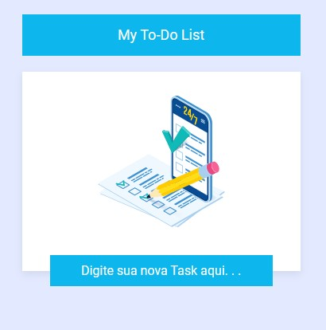

# App To-Do List

This project was generated with [Angular CLI](https://github.com/angular/angular-cli) version 16.1.4.

App para organizar suas tarefas, onde você pode adicioná-las, modificá-las e removê-las quando quiser.

## Tenologias Utilizadas
 
 
 
  
  
 
  

 

 
 

 <h1>Sobre o App</h1>
 

 ⚡ - Neste app o usuário poderá adicionar tarefas diárias, podendo marcar quais foram completadas ou até mesmo deletar as tarefas inseridas, sendo de forma única (uma por vez) ou todas de uma só vez.
 

 

 ⚡ - No campo adicionar tarefas, ele terá que digitar um valor específico que será adicionado a lista de tarefas.
 

 

 ⚡ - Assim que a tarefa for adicionada, esta será enviada para uma lista onde o usuário poderá fazer algumas ações, como:
  
      
✔ <b>Checked</b>: Assim que o usuário clicar no "input" checked sua tarefa estará pronta e deverá ir pro final da lista.
 
       
🚫 <b>Delete</b>: Assim que o usuário clicar no ícone da lixeira sua tarefa deverá ser deletada. 
 
 

 

 ⚡ - Botão para deletar todas as atividades.
  
      💥 Assim que clicar no botão para deletar todas as tarefas inseridas deverá aparecer um pop-up de confirmação se você realmente quer apagar tudo.
 

 

 ⚡ Obervação
 

 
Sem que for inserido uma atividade e esta por algum motivo ficar vazia, aparecerá um pop-up confirmando se você quer removê-la.</>
 

 <h2>Vercel</h2>
 <a href="">[App To-Do List](https://app-to-do-list-delta.vercel.app/)</a>

## Development server

Run `ng serve` for a dev server. Navigate to `http://localhost:4200/`. The application will automatically reload if you change any of the source files.

## Code scaffolding

Run `ng generate component component-name` to generate a new component. You can also use `ng generate directive|pipe|service|class|guard|interface|enum|module`.

## Build

Run `ng build` to build the project. The build artifacts will be stored in the `dist/` directory.

## Running unit tests

Run `ng test` to execute the unit tests via [Karma](https://karma-runner.github.io).

## Running end-to-end tests

Run `ng e2e` to execute the end-to-end tests via a platform of your choice. To use this command, you need to first add a package that implements end-to-end testing capabilities.

## Further help

To get more help on the Angular CLI use `ng help` or go check out the [Angular CLI Overview and Command Reference](https://angular.io/cli) page.
